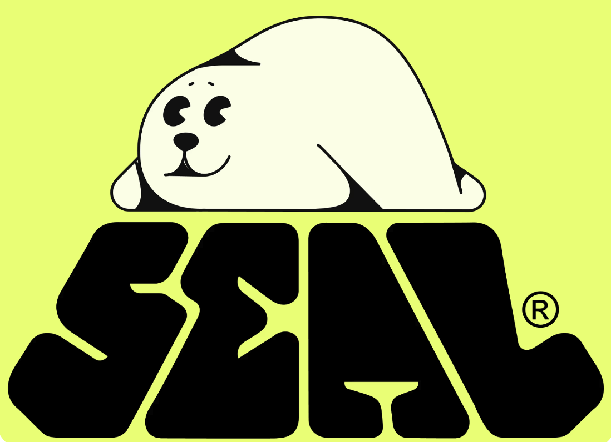

# Seal

[Seal](https://seal.mystenlabs.com/) is a decentralized secrets management (DSM) product. Application developers and users can use Seal to secure sensitive data at rest on decentralized storage like [Walrus](https://docs.wal.app/) or any other onchain / offchain storage. Seal enables identity-based encryption and decryption of sensitive data, with access controlled by onchain policies on Sui. Lightweight key servers enforce these policies and provide threshold-based decryption keys, while developers can integrate easily using the [TypeScript SDK](https://www.npmjs.com/package/@mysten/seal).

> [!IMPORTANT]
> Refer to the Seal documentation at [seal-docs.wal.app](https://seal-docs.wal.app) for a deeper product overview and details on the design, developer and key server usage, available key servers, security best practices, and terms of service. As a backup, you can also find the same content in the [docs directory](./docs/).

## Contributing

If you’d like to contribute code or documentation, please review our [contributing workflow](./CONTRIBUTING.md) before getting started.

## Contact Us

For questions about Seal, use case discussions, or integration support, contact the Seal team on [Sui Discord](https://discord.com/channels/916379725201563759/1356767654265880586) or create a Github issue.
